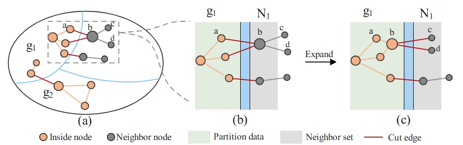
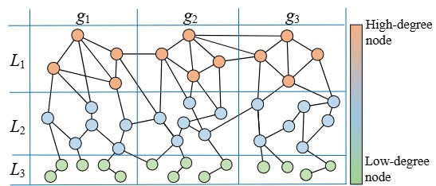
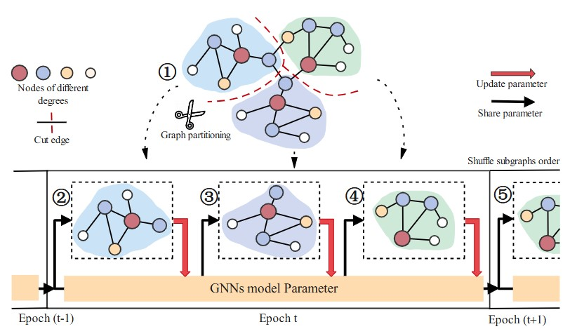

### LocalDGP

========

The code corresponds to article "LocalDGP: Local Degree-balanced Graph Partitioning for Lightweight GNNs", submitted to Applied Intelligence.
<p align="center">
  
  <br>
  <em>Partitioning Process of LocalDGP</em>
</p>

<p align="center">
  
  <br>
  <em>Degree-balanced in LocalDGP</em>
</p>

### Train GNNs on Subgraphs

<p align="center">
   
</p>

### Experimental environment 
Except for the GAT on the Reddit and ogbn-products datasets, which are performed on NVIDIA A100 TENSOR CORE GPU (80GB GPU memory), the rest of the experiments are performed on NVIDIA GeForce RTX 3090 GPU (24GB GPU memory).
The CPU and RAM settings are all Intel Xeon Silver 4214R CPU (12 cores, 2.40GHz), and 256GB of RAM.


### Requirements
The LocalDGP is used to install the following package versions.
```
libgoogle-glog-dev 
libgflags-dev 
libboost-all-dev
```
The GNNs codebase is implemented in Python 3.8.12. package versions used for development are just below.
```
torch              1.12.1
ogb                1.3.6
dgl                0.9.1
numpy              1.21.2
pandas             2.0.3
torchmetrics       1.0.3
```


### Datasets
<p align="justify">
 AmazonCoBuy and Reddit datasets are from the Deep Graph Library (DGL). The ogbn-arxiv and ogbn-products are from Open Graph Benchmark (OGB) Dataset.</p>
 

### Examples
<p align="justify">
Use the following commands for graph partitioning

```sh
$ mkdir release && cd release
cmake ..
make -j8
./LocalDGP -filename /Reddit.adjlist.txt -p 40 -weight_level 5
```

<p align="justify">
Use the following commands to learn the neural network and score on the test set. </p>

```
python GNNs.py
```


----------------------

